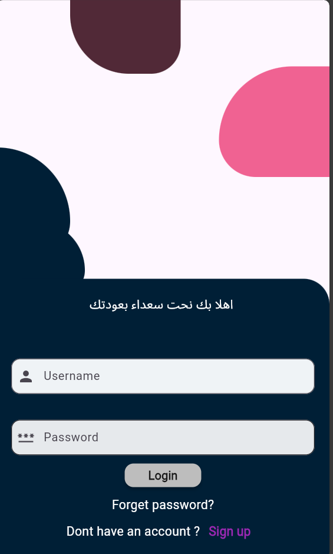
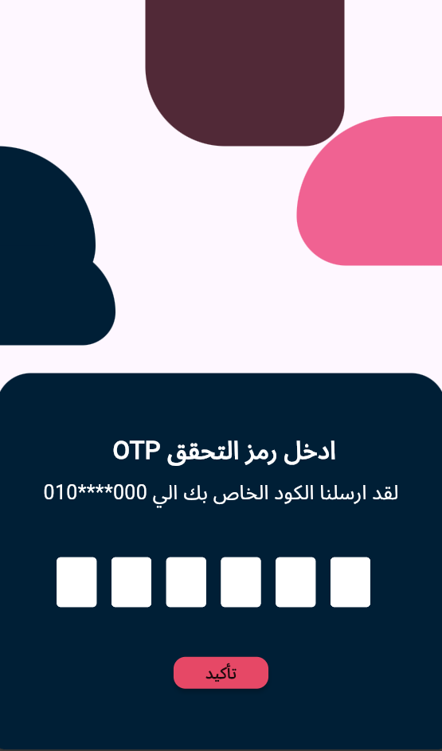
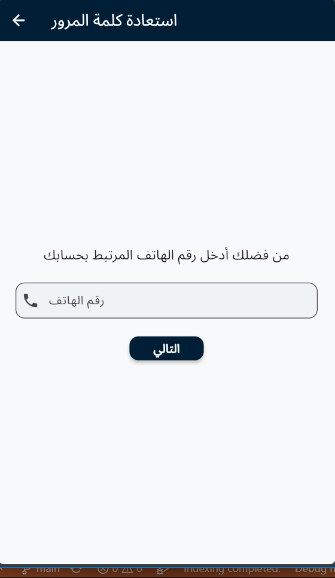
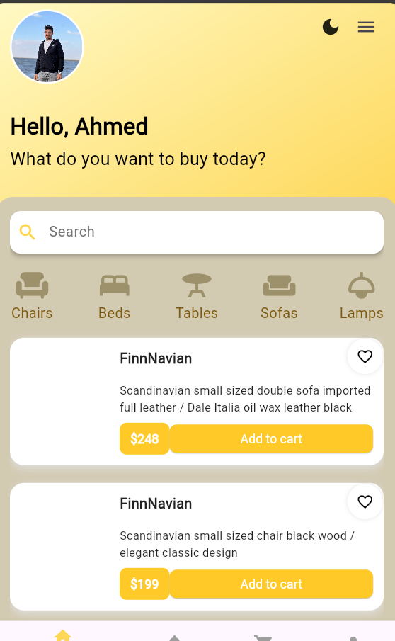
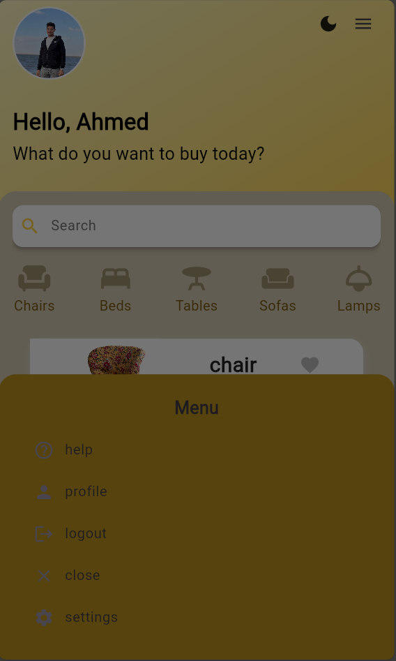

# 🛍️ Flutter Marketing App

This is a Flutter-based marketing app built with clean UI components, custom theming, and navigation logic. The app includes multiple screens such as splash, login, OTP, home, and password reset.

---

## ✨ Features

- 🖼️ Splash Screen
- 🔐 Login & OTP Verification
- 🔁 Forget Password Flow
- 🏠 Home Screen with Categories
- 🎨 Custom App Theme (Dark / Light mode)
- 📱 Bottom Navigation Bar & Modal Bottom Sheet

---

## 📸 Screenshots

| Splash | Login | OTP | Forget Password |
|-------|--------|-----|-----------------|
|  |  |  |  |

<br/>

| Home | Bottom Navigation |
|------|-------------------|
|  |  |

---

## 🛠️ Technologies Used

- **Flutter**
- **Dart**
- **Firebase Auth** (for login & OTP)
- **Custom Widgets** (Theming, Bottom Nav, AppBar, etc.)

---
lib/
├── res/                # Colors, styles, themes
├── models/             # Data models
├── widgets/            # Reusable widgets (AppBar, BottomNav, etc.)
├── screens/            # UI Screens (login, home, otp, etc.)
└── main.dart           # App entry point

## 🚀 Getting Started

```bash
flutter pub get
flutter run
